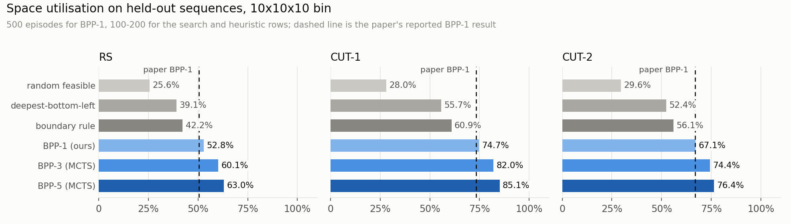
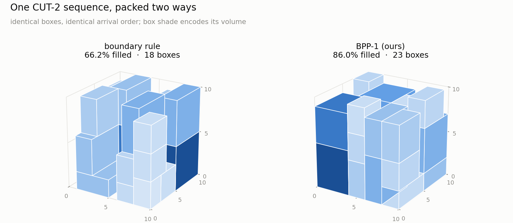
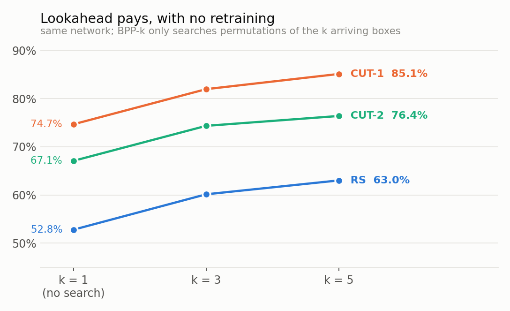
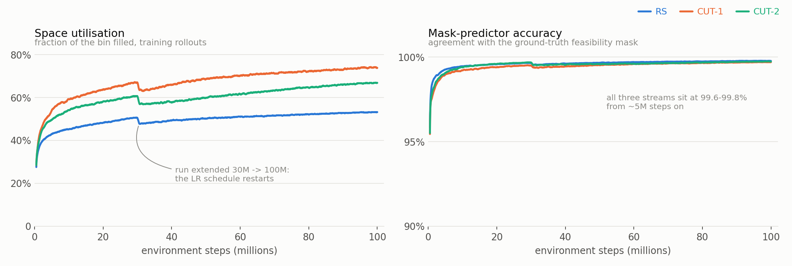
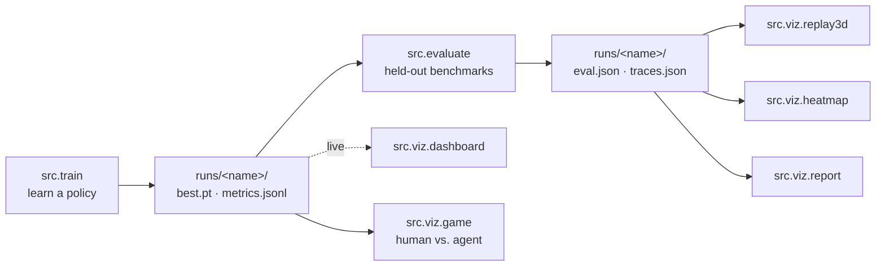
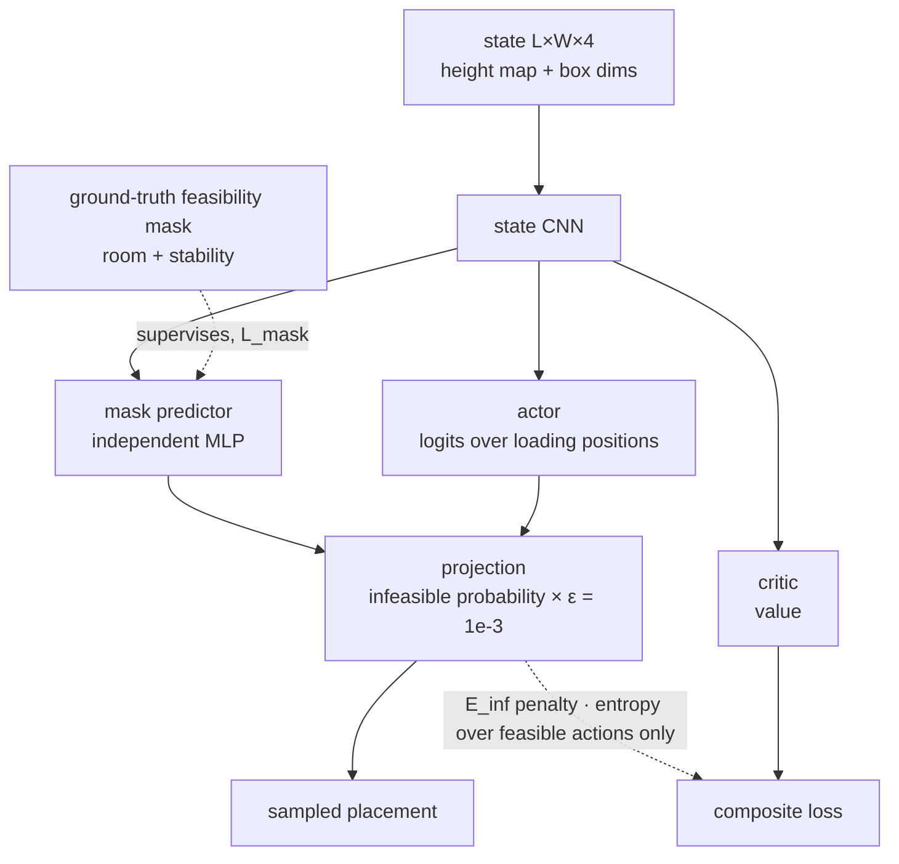

# Online 3D Bin Packing with Constrained Deep RL

A from-scratch reproduction of **"Online 3D Bin Packing with Constrained Deep
Reinforcement Learning"** — Zhao, She, Zhu, Yang & Xu, AAAI 2021
([arXiv:2006.14978](https://arxiv.org/abs/2006.14978); the paper is
[`paper.pdf`](paper.pdf) in this directory).

Boxes arrive **one at a time** on a conveyor. You see the box in front of you and
nothing else, you must place it immediately, and it can never be moved again. The
agent decides *where* it goes on the pallet. The score is how much of the bin is
full when nothing else fits.



Our BPP-1 policy matches the paper on all three benchmarks, and the test-time
tree search (BPP-3 / BPP-5) adds another 7–10 points on top of it **without any
retraining**.

---

## Table of contents

- [Results](#results)
- [Install](#install)
- [How to run](#how-to-run)
- [How it works](#how-it-works)
- [The five views](#the-five-views)
- [Play against the agent](#play-against-the-agent)
- [Repository layout](#repository-layout)
- [Caveats and open questions](#caveats-and-open-questions)

---

## Results

Everything below is measured on held-out sequences in a `10×10×10` bin with the
paper's 64 item types, sizes 2–5 per axis.

### Against the paper

| Benchmark | Paper BPP-1 | **Ours (BPP-1)** | Δ | Paper items | Ours items |
|---|---|---|---|---|---|
| RS    | 50.5% | **52.8%** | +2.3 pp | 12.2 | 12.8 |
| CUT-1 | 73.4% | **74.7%** | +1.3 pp | 19.1 | 19.3 |
| CUT-2 | 66.9% | **67.1%** | +0.2 pp | 17.5 | 18.1 |

Reproduced — with PPO in place of the paper's ACKTR, and with every term of the
constrained scheme kept intact. 500 evaluation episodes per cell.

### Against the baselines

| Method | RS | CUT-1 | CUT-2 |
|---|---|---|---|
| random feasible | 25.6% | 28.0% | 29.6% |
| deepest-bottom-left | 39.1% | 55.7% | 52.4% |
| boundary rule (spare cuboids) | 42.2% | 60.9% | 56.1% |
| **BPP-1 (ours)** | **52.8%** | **74.7%** | **67.1%** |
| BPP-3 (MCTS, no retraining) | 60.1% | 82.0% | 74.4% |
| BPP-5 (MCTS, no retraining) | 63.0% | 85.1% | 76.4% |

### What that looks like



Same boxes, same order. The heuristic commits early to placements that leave
un-fillable slivers; the policy keeps the height map flat and its options open,
and fits five more boxes into the same pallet.

### Lookahead is free performance



BPP-k is **not a second training run**. It is the *same* network, queried inside a
Monte-Carlo tree search over permutations of the `k` boxes currently visible. More
lookahead costs only test-time compute: BPP-1 evaluates an episode in 0.07 s,
BPP-5 in ~3.8 s.

### Training



Six networks were trained to 100M environment steps (3 benchmarks × 2 orientation
settings), ~1–2 h per 30M steps on an RTX 4070 Laptop. Two things to read here:

* **Utilisation is still climbing at 100M.** The 30M milestone was a budget, not
  convergence — the visible step at 30M is where each run was extended and the
  linear LR schedule restarted at its new horizon.
* **The mask predictor is essentially solved early.** It agrees with the
  ground-truth feasibility mask 99.6–99.8% of the time from ~5M steps on, which is
  what makes the projection trick below safe to rely on.

Regenerate every figure on this page from what is already in `runs/`:

```bash
python3 -m scripts.make_readme_figures        # -> docs/*.png
```

---

## Install

Python 3.10+ and, for training at any useful speed, a CUDA GPU. Evaluation,
replay and the browser tools all run fine on CPU.

```bash
git clone <this repo> && cd pallet_rl

python3 -m venv .venv && source .venv/bin/activate
pip install -r requirements.txt
```

`requirements.txt` is deliberately small — `torch`, `numpy`, `matplotlib`,
`imageio`. If you need a specific CUDA build of PyTorch, install it first from
[pytorch.org](https://pytorch.org/get-started/locally/) and then run the line
above; pip will leave the existing torch alone.

Check the install:

```bash
python3 -c "import torch; print(torch.__version__, torch.cuda.is_available())"
```

Nothing is downloaded at runtime. The benchmarks are *generated* — RS samples item
types at random, CUT-1 and CUT-2 cut a full bin into boxes and shuffle them, so
every sequence is synthetic and reproducible from its seed.

---

## How to run

Everything is a module, run from the project root. Every run writes to
`runs/<name>/`.



### Smoke test first

```bash
python3 -m src.train --preset smoke          # ~20 min, proves the pipeline works
python3 -m src.viz.dashboard --port 8080     # watch it: http://127.0.0.1:8080
```

### The real thing

```bash
# 1. TRAIN — paper config, 10x10x10, ~2 h per 30M steps on an RTX 4070
python3 -m src.train --preset paper --dataset CUT-2 --run bpp1_cut2

# 2. WATCH — second terminal, works while training is running
python3 -m src.viz.dashboard --port 8080

# 3. TEST — BPP-1, BPP-k MCTS and the baselines on held-out sequences
python3 -m src.evaluate --run bpp1_cut2 --datasets RS CUT-1 CUT-2 \
        --episodes 500 --bppk 2 3 5

# 4. SEE — step 3 must run first; it records the traces these read
python3 -m src.viz.replay3d --run bpp1_cut2 --all   # 3D packing GIFs / MP4s
python3 -m src.viz.heatmap  --run bpp1_cut2         # height map, masks, action probs
python3 -m src.viz.report   --run bpp1_cut2         # -> runs/bpp1_cut2/report.html

# 5. PLAY
python3 -m src.viz.game --port 8090                 # -> http://127.0.0.1:8090
```

### Unattended

```bash
./scripts/run_all.sh                    # ~12 h: 3 benchmarks + orientation + ablation
./scripts/train_all_options.sh          # the full 6-network matrix, resumable
```

Both resume rather than restart. Useful knobs: `STEPS=` to shorten,
`ORIENT_ONLY=1` for just the two-pose runs, `NO_EVAL=1` to train now and evaluate
later.

### The training matrix

**BPP-1, BPP-3 and BPP-5 are not separate trainings** — BPP-k reuses the BPP-1
network unchanged and only searches harder at test time, so it is an `--bppk`
flag on `src.evaluate`, not a run. The matrix is therefore 3 streams × 2
orientation settings:

| run | stream | orientations |
|---|---|---|
| `bpp1_rs` / `bpp1_orient_rs` | RS | 1 / 2 |
| `bpp1_cut1` / `bpp1_orient_cut1` | CUT-1 | 1 / 2 |
| `bpp1_cut2` / `bpp1_orient_cut2` | CUT-2 | 1 / 2 |

Full details, every flag and every timing: [`RUN.md`](RUN.md).

---

## How it works

### The state, the action, the constraint

The bin is an `L×W` integer **height map**. The arriving box is stretched into
three constant channels, giving an `L×W×4` state tensor. An action is a *loading
position* — the cell where the box's front-left-bottom corner goes — so there are
`L×W` of them (`2×L×W` when re-orientation is enabled).

Most of those actions are illegal at any given moment. The paper's contribution is
how it handles that:



The mask predictor is a **separate head trained by supervision**, not by the
policy gradient. Its prediction *modulates* the action distribution — infeasible
positions get their probability multiplied by `ε = 1e-3` rather than zeroed, which
the paper found trains better than hard masking. Two further terms enforce the
constraint: `E_inf` penalises probability mass left on infeasible positions, and
the entropy bonus is computed **only over feasible actions**. Paper Eq. 1:

```
L = α·L_actor + β·L_critic + λ·L_mask + ω·E_inf − ψ·E_entropy
α = 1,   β = λ = 0.5,   ω = ψ = 0.01
```

### Physical stability

A loading position is feasible only if it has room **and** the placement is stable
under the paper's conservative support criterion — one of:

* >60% of the box's bottom area supported, with all 4 bottom corners supported, **or**
* >80% of the area with ≥3 corners, **or**
* >95% of the area.

The mask is computed as a vectorised sliding-window max over the height map and was
checked cell-for-cell against a brute-force feasibility test, including the
two-orientation action space.

### BPP-k — searching without retraining

At test time only, the same network searches over permutations of the `k`
lookahead boxes (paper Sec. 3.3, Algorithm 1). Each tree node hallucinates a
placement by updating the height map. Order dependence is enforced by raising the
height map to `H` over the footprint of any *later-arriving* box that was
virtually placed first — so an earlier box can never end up stacked on a later
one. Backup uses the **max** return, not the mean (paper supplemental B).

### The benchmarks

| Stream | How a sequence is made | Perfect packing exists? |
|---|---|---|
| **RS** | item types sampled uniformly at random until their volume reaches the bin's | usually not |
| **CUT-1** | the bin is recursively cut into boxes, then ordered by the z of each box's front-left-bottom corner, ties broken randomly | yes, always |
| **CUT-2** | the same cut, ordered by *stacking dependency* — a box may arrive only once everything it rests on has arrived | yes, always |

Verified: replaying a CUT-2 sequence at its ground-truth positions gives 100%
utilisation in 300/300 trials.

---

## The five views

Training a packer is easy to get wrong quietly, so every stage has a view that
closes the loop.

| View | What it answers |
|---|---|
| **Live dashboard** — `src.viz.dashboard` | *Is it learning?* Utilisation, items/bin, mask accuracy, invalid-action rate, every loss term, episode-end reasons, throughput. Overlay several runs to compare the ablation. |
| **3D replay** — `src.viz.replay3d` | *How does it pack?* Step-by-step 3D bin, newest box outlined in red, exported as GIF/MP4 plus a contact sheet of final packings. |
| **Height-map view** — `src.viz.heatmap` | *Why did it choose that?* Height map, ground-truth mask, predicted mask with disagreements marked ×, and the projected action distribution, side by side. `--live` steps through with arrow keys. |
| **Report** — `src.viz.report` | *Did we reproduce it?* Our numbers against the paper's Tables 1, 3 and 4, the BPP-k curve, utilisation histograms, training curves and embedded replays, in one self-contained HTML file. |
| **Duel** — `src.viz.game` | *Can you beat it?* You pack the stream by hand; the same sequence is then handed to the agent and the two packings are scored side by side. |

---

## Play against the agent

```bash
python3 -m src.viz.game --port 8090     # -> http://127.0.0.1:8090
```

Safe to run while training — it only reads checkpoints, and the three heuristic
opponents need no checkpoint at all.

Pick the benchmark that generates the stream, pick your opponent, and pack. You
click a cell to drop the arriving box with its front-left-bottom corner there; it
lands on whatever is underneath, and the same stability rule the agent is held to
refuses unsupported spots. When nothing fits any more, the agent replays your
exact sequence and you get both packings, both utilisations, and a step slider
that walks the two bins forward box for box.

**You are held to the opponent's information, not your own.** Your lookahead *is*
its lookahead: BPP-1 and the heuristics leave "coming next" empty, while BPP-k
shows you the other k−1 boxes — plus the one box beyond the window that the search
peeks at to value the bin, drawn dashed and marked *peek only*, because neither of
you may place or reorder it. Rotation likewise applies to both of you or neither;
a trained net is locked to the `orientations` it was trained with, so only the
heuristics can be asked to play the two-pose game.

The opponent list is filtered to the agents actually trained on the stream you
picked; a checkbox unlocks the rest, flagged as off-distribution. Every 3D bin is
a draggable camera with labelled x/y/z axes and unit ticks, and the two result
bins share one camera so they always compare at the same angle. Boxes are drawn to
scale against the pallet grid: a 4×2×3 is four cells by two.

Every duel is appended to `runs/duel_log.jsonl` and shown on the setup screen.

---

## Repository layout

```
src/config.py      presets and every hyper-parameter
src/items.py       |I| = 64 item types; RS / CUT-1 / CUT-2 sequence generators
src/bin3d.py       height map, stability criterion, vectorised feasibility mask
src/env.py         BPP-1/BPP-k environment + synchronous vector env
src/model.py       state CNN -> actor/critic + independent mask predictor
src/ppo.py         PPO with the paper's composite loss
src/train.py       training loop, checkpointing, --resume, ablation switches
src/mcts.py        BPP-k permutation tree search (Algorithm 1)
src/baselines.py   boundary rule (spare cuboids), deepest-bottom-left, random-feasible
src/evaluate.py    held-out benchmark evaluation + trace recording
src/viz/           dashboard, replay3d, heatmap, report, game
scripts/           run_all.sh, train_all_options.sh, README figure generation
runs/<name>/       config.json, metrics.jsonl, best.pt, eval.json, traces.json, report.html
```

Companion docs: [`RUN.md`](RUN.md) (every command and flag),
[`DASHBOARD.md`](DASHBOARD.md) (what each panel means),
[`TODO.md`](TODO.md) (status, open questions, what is verified).

---

## Caveats and open questions

**PPO, not ACKTR.** The optimiser is the one documented deviation from the paper.
Every term of the constrained scheme — which is the paper's actual contribution,
and what its own ablation shows drives the results — is kept intact, and the BPP-1
numbers land on the paper's. Whether ACKTR would add anything on top is still
open; it is item 1 in [`TODO.md`](TODO.md).

**Our boundary rule is a stronger baseline than the paper's.** We measure the
spare-cuboid boundary rule at 60.9% on CUT-1 and 56.1% on CUT-2 against the
paper's reported 41.2% / 40.8%. Either their variant is weaker than the
supplemental describes, or our maximal-cuboid enumeration is more thorough — so
the margin the report claims over the heuristic is conservative in our disfavour.

**Re-orientation helps on RS and hurts on CUT-1.** Training-rollout utilisation,
step-matched at 30M so the two settings are comparable:

| Stream | 1 orientation | 2 orientations | Δ |
|---|---|---|---|
| RS | 50.5% | **58.8%** | **+8.3 pp** |
| CUT-1 | **67.0%** | 63.5% | −3.5 pp |
| CUT-2 | 60.7% | **61.8%** | +1.1 pp |

RS reproduces the paper's Table 4 gain. CUT-1 going *down* cannot be a
representational problem — pose 0 stays available in the larger action space — so
it is an optimisation cost. The two-pose runs lead on every stream early and are
overtaken on CUT-1 at ~5M steps. Diagnosis is in progress; the evidence gathered so
far is written up in [`TODO.md`](TODO.md).

**The MP / MC / FE ablation has not been run yet.** `src.train` carries the
`--no-mp` / `--no-mc` / `--no-fe` switches and `src.viz.report` knows the paper's
Table 1 numbers, but the four ablation runs are still queued — so nothing here
independently confirms *which* term of the constrained scheme is doing the work.

**Runs are single-seed.** Every number on this page comes from one training seed
per configuration. Treat differences under ~2 points as noise.
