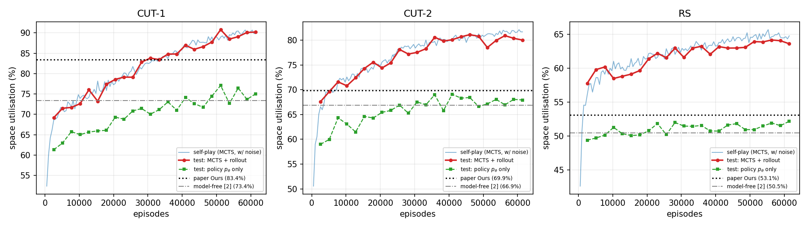

# Online 3D Bin Packing RL with Buffer — reproduction

Implementation of **"Online 3D Bin Packing Reinforcement Learning Solution with Buffer"**
(A. Valero Puche & S. Lee, arXiv:2208.07123) — an AlphaGo adaptation for the online 3D-BPP.

## Result

100 held-out test sequences per dataset, 10x10x10 bin, single-item buffer (b=1), no
reorientation (k=0) — the paper's Table II setting.

**Two protocols, and they must not be mixed.** The paper uses the known item sequence
during *training only*: "we simply use the corresponding sequence during training (not
inference)" (Sec. VI-C), and Table III reports "the performance of our trained policy".
So its numbers are online, with no knowledge of what is coming. The like-for-like
comparison is therefore our **policy-only** column.

| Dataset | Heuristics [8] | Model-free [2] | Paper (Ours) | **This run, policy only** | % of paper |
|---|---|---|---|---|---|
| CUT-1 | 15.2 / 59.8% | 19.1 / 73.4% | 21.3 / 83.4% | **75.1%** | 90% |
| CUT-2 | 17.3 / 61.2% | 17.5 / 66.9% | 18.0 / 69.9% | **67.9%** | 97% |
| RS    | 13.8 / 54.3% | 12.2 / 50.5% | 13.1 / 53.1% | **52.2%** | 98% |

Close to the benchmark, below it on all three, and clearly short on CUT-1.

61,440 self-play episodes per dataset, ~4 h wall-clock each on one RTX 4070 Laptop;
the three ran concurrently.



### How much of MCTS is search, and how much is knowing the sequence?

Running MCTS at *inference* over the real remaining stream gives much higher numbers —
89.8 / 80.6 / 63.2% — but that is an oracle the paper does not grant itself. To price it,
`lookahead_value.py` lets the tree plan against a different future than the environment
delivers (`Runner.play(..., belief=...)`):

| what the search knows | CUT-1 | CUT-2 | RS |
|---|---|---|---|
| nothing (policy only)              | 75.1% | 67.9% | 52.2% |
| the item distribution only         | 71.5% | 67.7% | 51.0% |
| which boxes, but not the order     | 77.5% | 70.4% | 50.8% |
| the actual stream                  | **89.8%** | **80.6%** | **63.2%** |

**Search with no sequence knowledge is worth nothing** — −3.6 / −0.2 / −1.2 points, i.e.
slightly *worse* than the bare policy on all three. Every point MCTS adds here comes from
the oracle. Leaf values are obtained by rolling the episode out; with the wrong future
items that ranking is noise, and following it is worse than following the prior. This is
the paper's own stated reason for abandoning stochastic sequences ("a small perturbation
... can drastically change the value estimation"), measured.

Splitting the oracle in two: knowing *which* boxes are coming is worth +6.0 / +2.7 / −0.2
and knowing *when* is worth +12.4 / +10.2 / +12.5. Order dominates. RS gains nothing from
the multiset, as expected — its items are i.i.d. uniform, so the multiset carries no
information.

## What is implemented

| file | contents |
|---|---|
| `bpp/env.py` | Py3DBP preventive simulator (Sec. III / V-A): height map `H_t`, the three disjunctive stability rules, reward `r_i = 10 V_i/V_B`, action mask over `W x L x b x (k+1)` |
| `bpp/datasets.py` | CUT-1 / CUT-2 / RS generators (Sec. IV), 2000 train + 100 test sequences each |
| `bpp/model.py` | policy and value nets: 6 conv layers, 128 planes, ReLU; masked softmax; tanh value head (Sec. V-B) |
| `bpp/mcts.py` | AlphaGo adaptation (Sec. V-C): UCT Eq. 1, rollout leaf evaluation with action sampling, single-player score conversion by subtracting the baseline policy's return |
| `bpp/augment.py` | the 8 bin symmetries with exact FLB relocation (Sec. V-D) |
| `bpp/replay.py` | prioritized experience replay [23] |
| `bpp/train.py` | data generation + parameter update, loss Eq. 2 |
| `bpp/evaluate.py` | test-set evaluation vs. the paper's numbers |
| `bpp/viz/` | the viewers: duel, dashboard, report, replay, heatmap (below) |

Also supports the paper's other configurations: buffer `--b 2/3` (Table III) and
reorientation `--k 1` (Table II lower half).

## Viewers

Five ways to look at what the agent is doing. All of them read the same simulator,
so nothing shown is a re-implementation that could drift from what was trained.

```bash
python3 -m bpp.viz.game                        # play the agent yourself -> :8090
python3 -m bpp.viz.dashboard                   # live training curves    -> :8080
python3 -m bpp.viz.report --packing cut1 cut2 rs   # -> results/report.html
python3 -m bpp.viz.replay3d --ckpt runs/cut1_v2/last.pt --data cut1 --gif
python3 -m bpp.viz.heatmap  --ckpt runs/cut1_v2/last.pt --data cut1 --gif
```

**`game`** — a human-vs-agent duel. You pack a stream by hand under the paper's own
rules: take any item out of the b-item buffer, turn it 90° when `k=1`, and drop it by
its front-left-bottom corner. The legal positions the page draws are `env.compute_masks`,
the very mask the agent searches, so both players face one action space. The same
sequence is then handed to the opponent — MCTS at any simulation count, the bare policy
`p_θ`, lowest-landing-height, or random — and the two bins are scored side by side with
a step-by-step replay. Opponents are discovered from `runs/`, and each one plays in the
geometry its own checkpoint was trained on.

Two fairness details are surfaced rather than hidden. A network only ever sees the
buffer, so against `policy` the upcoming stream is hidden from you too. MCTS, however,
rolls the *real* remaining sequence out at every leaf, so against it the queue is shown
to you as well.

**`dashboard`** — polls `runs/*/log.jsonl` while training runs: self-play utilisation
against its own greedy baseline, the held-out MCTS evaluation, both losses, filter
survival, replay size, iteration time. The paper's number for that `(dataset, b, k)` is
drawn as a dashed target line, so "are we there yet" is answerable at a glance. Several
runs can be overlaid.

**`report`** — one self-contained HTML page (charts inlined as SVG, bins as base64 PNG)
with the full comparison table, per-run training curves and a rendered packing.

**`replay3d`** — a packed bin built up one box at a time, as PNG frames or a GIF.

**`heatmap`** — the debugging view for a single decision: height map, landing height per
loading position, how many of the `M` item/orientation combos are feasible per cell, and
`p_θ` over the board.

## Correctness checks

* **Simulator** — a plain "lowest-landing-height" heuristic scores 57.0% on CUT-1 against
  the 59.8% the paper reports for heuristics [8]; CUT sequences sum to exactly 1000 volume,
  so a 100% pack exists.
* **Augmentation** — all 8 symmetries verified to map feasible actions to feasible actions
  and to preserve the action-mask cardinality exactly (0 violations).
* **Optimisations** — the vectorised transition and the radix-32 integral-image support
  count were both checked bit-identical to the straightforward implementations.

## Speed

The paper reports ~0.80 s per 100 MCTS simulations and ~1 day of training. Two changes
give ~81 ms per *episode* here (a full episode is ~22 steps x 100 simulations):

1. **Batched MCTS over a shared arena.** All 512 concurrent episodes descend, expand and
   back up as single vectorised numpy operations over one flat node arena, and every network
   query (leaf priors and each rollout step) is issued once for the whole batch.
2. **Radix-32 integral image for the support count.** Encoding a cell of height `v` as
   `32**v` makes a window sum a base-32 histogram of the heights it contains (a window holds
   at most 25 cells < 32, so digits never carry); the digit at `h_max` is the number of
   supporting cells. 2.7x faster than sliding-window reductions, and exact.

## Reproduce

```bash
python3 -m bpp.datasets data                    # build CUT-1 / CUT-2 / RS
python3 -m bpp.train --data cut1 --name cut1 \
    --iters 120 --games 512 --sims 100 --updates 120 \
    --c_puct 4.0 --dir_eps 0.05 --temp_moves 0
python3 -m bpp.evaluate runs/cut1/last.pt cut1 --reps 3
python3 report.py && python3 plot_curves.py
python3 -m bpp.viz.report --packing cut1 cut2 rs
```

## Deviations from the paper

The paper does not state the move-selection rule during data generation, `c_puct`, or the
Dirichlet weight. Tuned on a held-out sweep: `c_puct = 4.0`; the real move is the arg-max
visit count (sampling from visit counts cost ~13 points of self-play utilisation, since a
single bad early placement ruins a 22-step episode); Dirichlet noise `eps = 0.05` rather
than AlphaZero's 0.25, for the same reason. Everything else follows the paper.
